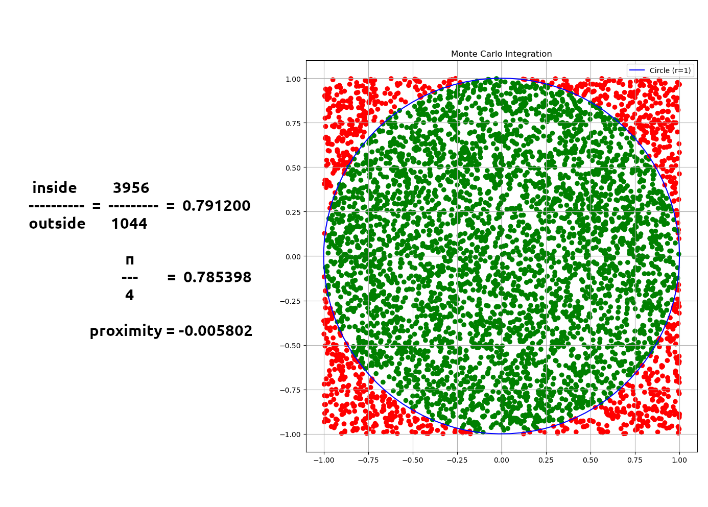
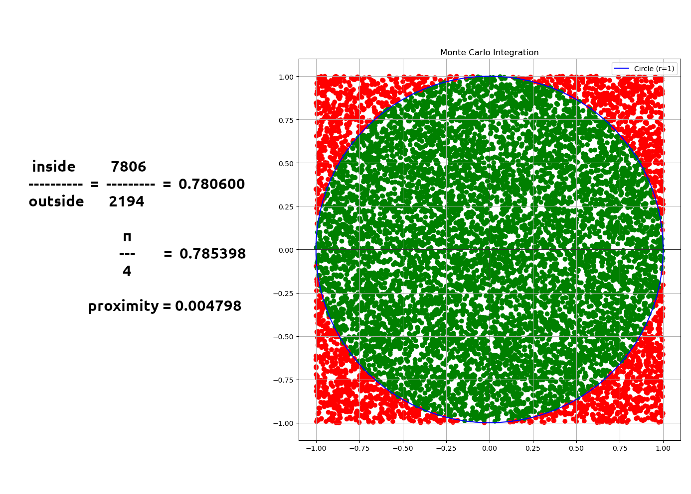
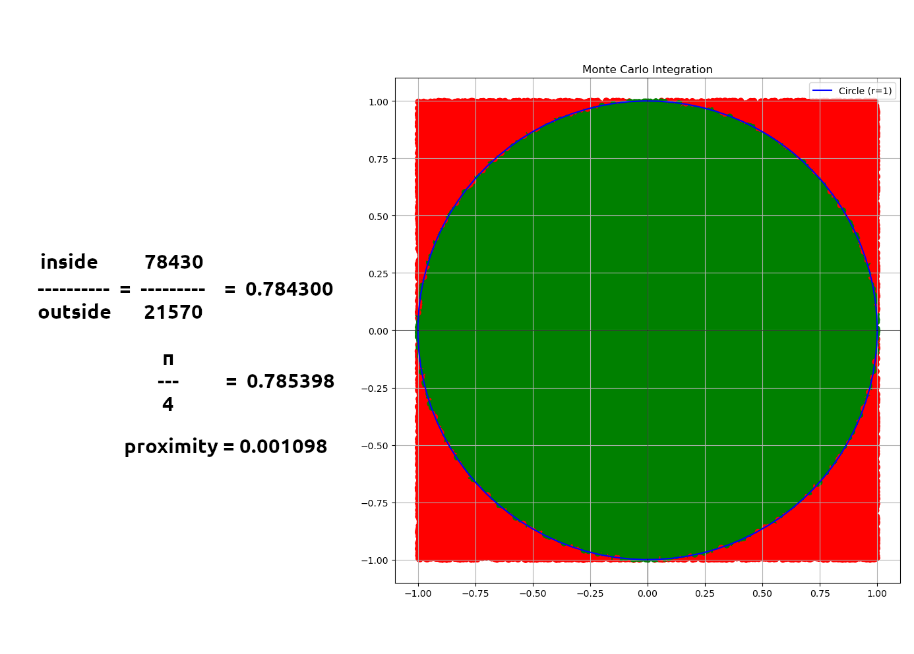
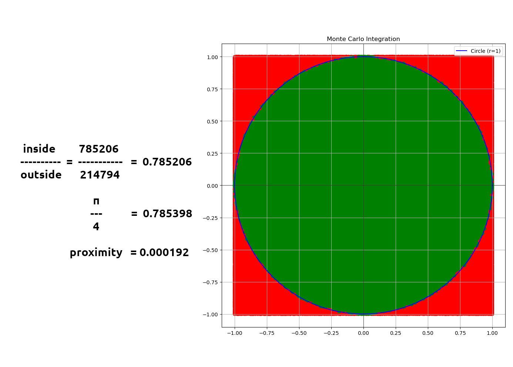

# Monte Carlo Integration

Testing the randomness of a pseudo-random number generator through the Monte Carlo Integration.

```
            y
            ^
           1|
   0--------|--------0      Backdrop is delimited by 0
   |     ___|___     |      Dartboard is inside the backdrop
   |    /   |   \    |
   |   /    |    \   |
   |  |     |     |  |
------|-----------|------> x
 -1|  |    0|     |  |1
   |   \    |    /   |
   |    \___|___/    |
   |        |        |
   0--------|--------0
          -1|
```

 After throwing 100_000 darts, we can note that the ratio between the number of darts that landed inside the circle and the number of darts that landed outside the circle (but still, inside the square)
Is approximately equal to the ratio between the two areas.
- Yes, proportional to π (multiply the result by 4).

```

  landed inside      786152
 ---------------- = -------- =  0.785768   (note how 0.785768 * 4 = 3.143072
  landed outside     213848                                 and π = 3.141592)

                       π
                      ---    =  0.785398
                       4

                   proximity = -0.000370

```

This proves that, even though pseudo, our random number generator is (approximately) right

---

## Benchmarking

- π / 4 = 0.785398

```
0------------------------------------0  0------------------------------------0
| Throwing 50 darts                  |  | Throwing 100 darts                 |
|-----------0----------0-------------|  |-----------0----------0-------------|
| Times     | Mean     | Proximicity |  | Times     | Mean     | Proximicity |
|-----------0----------0-------------|  |-----------0----------0-------------|
| 5_000     | 0.786632 | -0.001234   |  | 5_000     | 0.786974 | -0.001576   |
| 10_000    | 0.784586 |  0.000812   |  | 10_000    | 0.785995 | -0.000597   |
| 100_000   | 0.785283 |  0.000115   |  | 100_000   | 0.785491 | -0.000092   |
| 1_000_000 | 0.785460 | -0.000062   |  | 1_000_000 | 0.785397 |  0.000002   |
0------------------------------------0  0------------------------------------0

0------------------------------------0  0------------------------------------0
| Throwing 500 darts                 |  | Throwing 1_000 darts               |
|-----------0----------0-------------|  |-----------0----------0-------------|
| Times     | Mean     | Proximicity |  | Times     | Mean     | Proximicity |
|-----------0----------0-------------|  |-----------0----------0-------------|
| 5_000     | 0.785392 |  0.000006   |  | 5_000     | 0.785399 | -0.000000   |
| 10_000    | 0.785444 | -0.000046   |  | 10_000    | 0.785252 |  0.000146   |
| 100_000   | 0.785483 | -0.000085   |  | 100_000   | 0.785367 |  0.000031   |
| 1_000_000 | 0.785378 |  0.000020   |  | 1_000_000 | 0.785421 | -0.000023   |

0------------------------------------0  0------------------------------------0

0------------------------------------0  0------------------------------------0
| Throwing 10_000 darts              |  | Throwing 100_000 darts             |
|-----------0----------0-------------|  |-----------0----------0-------------|
| Times     | Mean     | Proximicity |  | Times     | Mean     | Proximicity |
|-----------0----------0-------------|  |-----------0----------0-------------|
| 5_000     | 0.785379 |  0.000019   |  | 5_000     | 0.785420 | -0.000022   |
| 10_000    | 0.785427 | -0.000029   |  | 10_000    | 0.785398 |  0.000001   |
| 100_000   | 0.785394 |  0.000004   |  | 100_000   | 0.785394 |  0.000005   |
| 1_000_000 | 0.785405 | -0.000006   |  | 1_000_000 | 0.785399 | -0.000001   |
0------------------------------------0  0------------------------------------0
```

<details> <summary>Here's what it looks like visually:</summary>

- Green dots are darts that landed inside the circle.
- Red dots are darts that landed outside the circle.

#### Throwing 5_000 darts


#### Throwing 10_000 darts


#### Throwing 100_000 darts


#### Throwing 1_000_000 darts

</details>

# Build and run

Build
```bash
$ make
```

Run
```bash
./monte_carlo_integration
```

Output
```bash
[Benchmarking with 50 throws]
5000 times    -> Mean = 0.785980 | Proximicity = -0.000582
10000 times   -> Mean = 0.786696 | Proximicity = -0.001298
100000 times  -> Mean = 0.785468 | Proximicity = -0.000070
1000000 times -> Mean = 0.785410 | Proximicity = -0.000012

[Benchmarking with 100 throws]
5000 times    -> Mean = 0.785728 | Proximicity = -0.000330
10000 times   -> Mean = 0.784965 | Proximicity =  0.000433
100000 times  -> Mean = 0.785184 | Proximicity =  0.000214
1000000 times -> Mean = 0.785404 | Proximicity = -0.000006

[Benchmarking with 500 throws]
5000 times    -> Mean = 0.785220 | Proximicity =  0.000179
10000 times   -> Mean = 0.785132 | Proximicity =  0.000266
100000 times  -> Mean = 0.785389 | Proximicity =  0.000010
1000000 times -> Mean = 0.785425 | Proximicity = -0.000027

[Benchmarking with 1000 throws]
5000 times    -> Mean = 0.785455 | Proximicity = -0.000057
10000 times   -> Mean = 0.785318 | Proximicity =  0.000080
100000 times  -> Mean = 0.785458 | Proximicity = -0.000059
1000000 times -> Mean = 0.785417 | Proximicity = -0.000018

[Benchmarking with 10000 throws]
5000 times    -> Mean = 0.785327 | Proximicity =  0.000071
10000 times   -> Mean = 0.785375 | Proximicity =  0.000024
100000 times  -> Mean = 0.785425 | Proximicity = -0.000027
1000000 times -> Mean = 0.785400 | Proximicity = -0.000002

[Benchmarking with 100000 throws]
5000 times    -> Mean = 0.785407 | Proximicity = -0.000009
10000 times   -> Mean = 0.785399 | Proximicity = -0.000001
100000 times  -> Mean = 0.785402 | Proximicity = -0.000004
1000000 times -> Mean = 0.785398 | Proximicity = -0.000000
```
